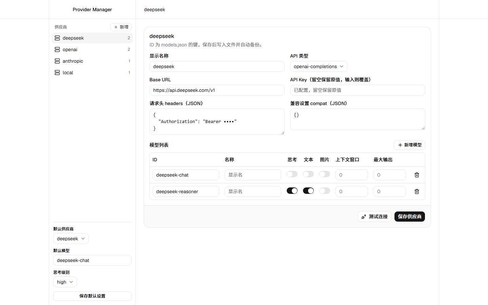
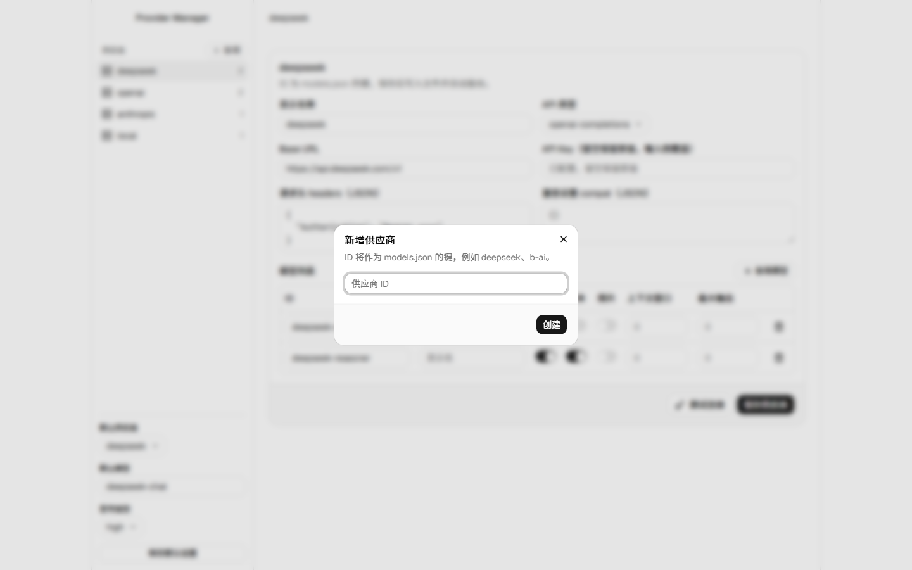
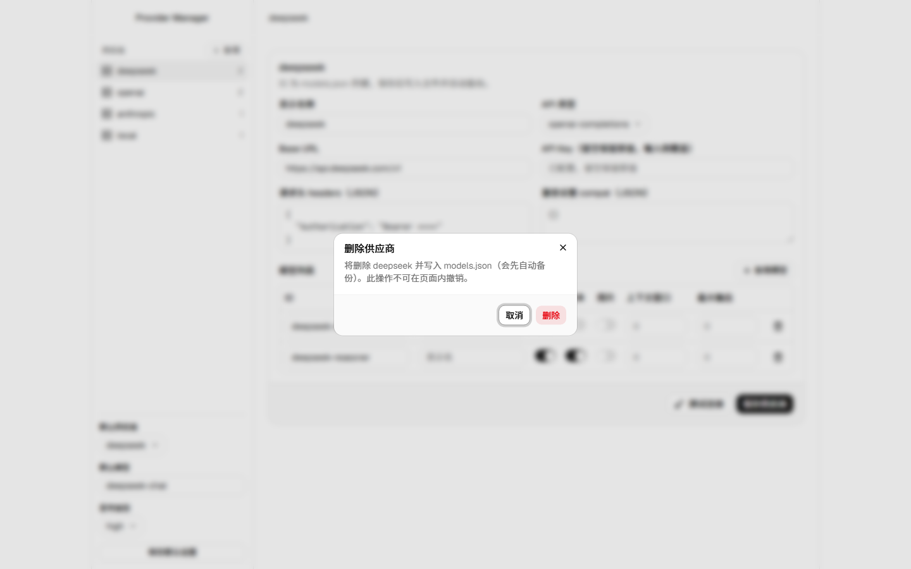
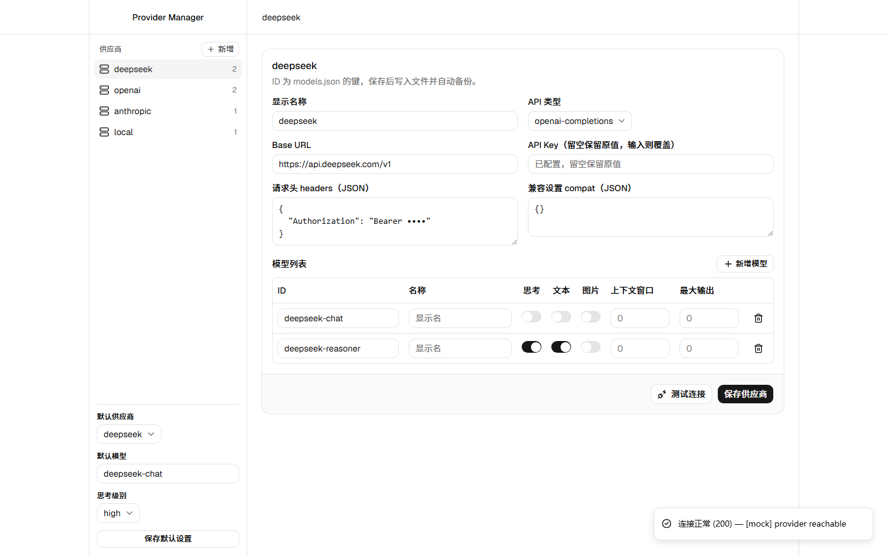
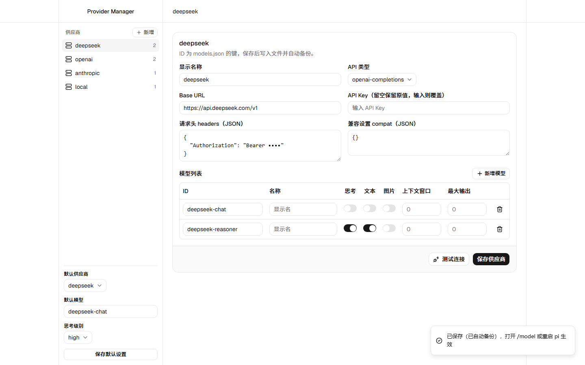

# pi Provider Manager

<p align="center">
  <strong>为 pi-coding-agent 提供可视化的自定义 LLM 供应商 / 模型管理</strong><br/>
  Manage custom LLM API providers, models, and default settings for <code>pi-coding-agent</code> via a local web UI.
</p>


`pi Provider Manager` 是 pi-coding-agent（npm 包 `@earendil-works/pi-coding-agent`）的一个扩展。在 pi 内执行 `/providers`，它会启动一个**仅本机可访问**的 Web 管理页，让你用图形界面增删改 `~/.pi/agent/models.json` 中的自定义 API 供应商 / 模型，并在 `~/.pi/agent/settings.json` 中设置默认供应商、默认模型与默认思考级别，完全免手改 JSON。

---

## ✨ 功能特性

- **🎛 增删改供应商与模型** —— 管理 `models.json` 的 `providers` 字段（`baseUrl` / `api` / `apiKey` / `headers` / `compat` / `models[]`），支持按 `id` 合并模型并保留 `cost`、`compat`、`thinkingLevelMap` 等字段。
- **🎯 一键设置默认项** —— 写入 `settings.json` 的 `defaultProvider` / `defaultModel` / `defaultThinkingLevel`。
- **🔑 密钥安全** —— `GET` 回读时 `apiKey` 打码为 `••••••`，真实密钥不回传；输入框留空 = 保留原值，输入新值 = 覆盖。
- **💾 自动备份** —— 每次保存前自动备份 `models.json` 至 `~/.pi/agent/models.backups/`，保留最近 10 份，误操作可回滚。
- **🔌 连接测试** —— 请求供应商 `baseUrl/models` 做连通性与鉴权检查。
- **🖥 现代 UI** —— React 19 + Vite 8 + TypeScript + Tailwind CSS 4 + shadcn/ui + Radix UI + Sonner，浅色界面，页内 Modal 确认、toast 反馈。
- **🔒 仅本机访问** —— 服务只绑定 `127.0.0.1`，生命周期跟随 pi 会话。

---

## 🖼 界面预览

> 以下截图由本地开发环境与模拟配置数据生成，用于展示关键操作界面。

管理页总览（供应商列表 + 编辑器 + 默认设置）：



新增供应商：



删除供应商（二次确认）：



测试连接（连通性 / 鉴权检查）：



保存成功（自动备份提示）：



---

## 📦 安装

### 方式一：Pi Package 一键安装（推荐）

本仓库已按 Pi Package 规范打包（根 `package.json` 含 `pi` 清单与 `pi-package` 关键字），发布到 npm 后即可通过 `pi install` 一键安装，并能在 Pi 的[包目录](https://pi.dev/packages)中检索：

```bash
# 从 git 安装（无需 npm 发布）
pi install git:github.com/KeywayTech-org/pi-provider-manager

# 从 npm 安装（发布后可用）
pi install npm:@keywaytech-org/pi-provider-manager
```

执行 `/reload`，然后输入 `/providers`。

> Pi 安装 npm/git 包时默认 `npm install --omit=dev`，不会自动构建前端。请先在本仓库执行 `npm run build`，确保 `web/dist` 已生成（npm 发布版会将该产物打进 tarball；git 安装则需手动构建后提交或先 `pi install` 再构建）。

### 方式二：克隆并接入 `settings.json`

先克隆本仓库并构建前端（前端产物 `web/dist` 不在版本控制内）：

```bash
git clone https://github.com/KeywayTech-org/pi-provider-manager.git ~/pi-provider-manager
cd ~/pi-provider-manager && npm --prefix web install && npm --prefix web run build
```

在 `~/.pi/agent/settings.json` 顶层新增（或合并）数组，指向本扩展入口：

```json
{
  "extensions": [
    "~/pi-provider-manager/provider-manager.ts"
  ]
}
```

在 pi 内执行 `/reload`，然后输入 `/providers`。

### 方式三：复制到自动发现目录

将 `provider-manager.ts` 复制到 `~/.pi/agent/extensions/`，执行 `/reload` 后即可。

> 扩展默认会托管 `web/dist` 下的前端构建产物；请确保该目录存在，或先构建（见下文「从源码构建」）。

### 发布到 Pi 包目录

本仓库可作为 Pi Package 发布到 npm，被 [pi.dev/packages](https://pi.dev/packages) 目录收录：

```bash
npm login                      # 需已登录发布 npm 包（含 scope 权限）
npm run build                  # 构建前端产物 web/dist
npm publish                    # 发布；tarball 已通过 prepack 自动构建
```

---

## 🚀 使用

1. 在 pi 中输入 `/providers`。
2. 浏览器自动打开管理页（也可手动访问终端打印的 `http://127.0.0.1:<port>/`）。
3. 左侧列出 `models.json` 的供应商，点选后在右侧编辑 `baseUrl` / `api` / `apiKey` / `headers` / `compat` 及模型列表。
4. 「保存供应商」写入 `models.json`；「保存默认设置」写入 `settings.json` 的 `defaultProvider` / `defaultModel` / `defaultThinkingLevel`。
5. 「测试连接」请求 `baseUrl/models` 检查连通性与鉴权。

> 修改 `models.json` 后，pi 在每次打开 `/model` 时自动重载；也可执行 `/model` 或重启 pi 立即生效。

---

## ⚙️ 配置

### 环境变量（可选）

| 变量 | 作用 |
|---|---|
| `PI_PROVIDER_MANAGER_CONFIG_DIR` | 指定配置目录（默认 `~/.pi/agent`），主要用于测试或自定义安装位置。 |
| `PI_PROVIDER_MANAGER_WEB_DIR` | 指定前端构建产物目录（`web/dist`），用于自定义打包或调试。 |

---

## 🔌 API

| 方法 / 路径 | 作用 |
|---|---|
| `GET /` | 返回管理页 HTML |
| `GET /api/config` | 返回打码后的 providers 与三项默认设置 |
| `PUT /api/config` | 写入 `models.json`（providers）与 `settings.json`（默认项） |
| `GET /api/test?provider=<name>` | 请求供应商 `baseUrl/models` 做连通性 / 鉴权检查 |

---

## 🛠 技术栈

- **后端**：Node.js（`node:http` / `node:fs` / `node:child_process`）、TypeScript，依赖 pi-coding-agent 扩展 API，零额外 npm 依赖。
- **前端**：React 19、Vite 8、TypeScript、Tailwind CSS 4、shadcn/ui、Radix UI、Sonner、lucide-react。

## 📁 项目结构

```
pi-provider-manager/
├── provider-manager.ts      # pi 扩展入口：注册 /providers，托管前端与 REST API
├── test-config.mjs          # 纯逻辑测试（maskKey / mergeProviders）
├── test-server.mjs          # 端到端测试（真实服务 + 临时配置目录）
├── DESIGN.md                # 设计文档（方案 A）
├── README.md
└── web/                     # React + Vite 前端，构建产物输出到 web/dist
    ├── src/
    └── dist/                # 由扩展静态托管（已忽略于版本控制）
```

---

## 🚧 从源码构建（开发）

前端为独立的 React + Vite 应用，构建产物静态输出到 `web/dist/`：

```bash
cd web
npm install
npm run build
```

重新构建后，在 pi 内重新执行 `/reload` 或重启 `/providers` 即可加载最新前端。

---

## 🧪 测试

```bash
# 纯逻辑（maskKey / mergeProviders）
node test-config.mjs

# 端到端（真实启动服务器 + 临时配置目录，验证读/写/打码/合并/删除）
node test-server.mjs
```

测试通过 `jiti` 加载 `provider-manager.ts`，需要本机已安装 pi-coding-agent（其 `node_modules` 中含 `jiti`）。若 `jiti` 路径因升级而变化，请同步修改两个测试文件顶部的 `jiti` 绝对路径。

---

## 🔒 安全与限制

- 服务仅绑定 `127.0.0.1`，仅本机可访问；生命周期随 pi 会话（`session_shutdown` 关闭，`server.unref()` 不阻塞退出）。
- 只管理 `models.json` 中的自定义供应商；位于 `extensions/*.ts` 中注册的供应商（如 `justwoker`、`xkiro`）**不会**出现在页面。
- API Key 留空表示保留原值；若想彻底清空某个 Key，需手动编辑 `models.json`（避免 UI 误删）。

---

## 📄 许可证

本仓库暂未提供许可证文件；若计划开源发布，请在仓库根目录补充 `LICENSE`。
